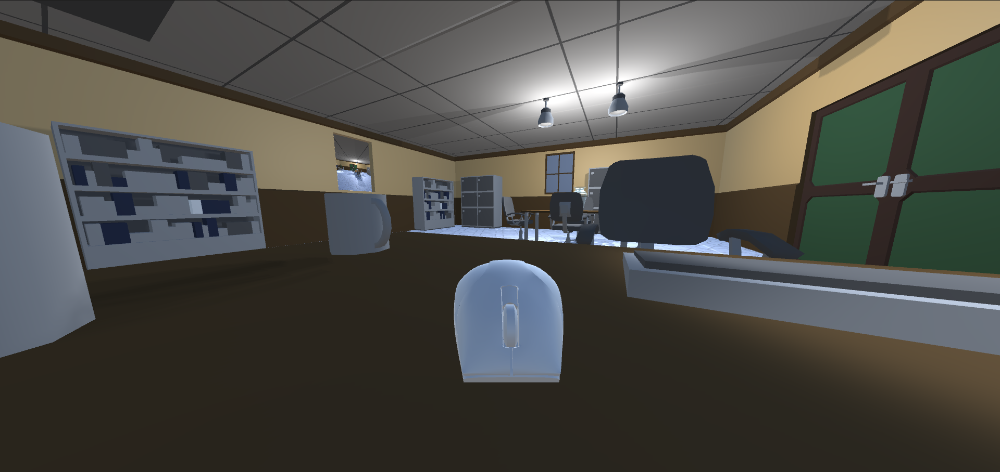
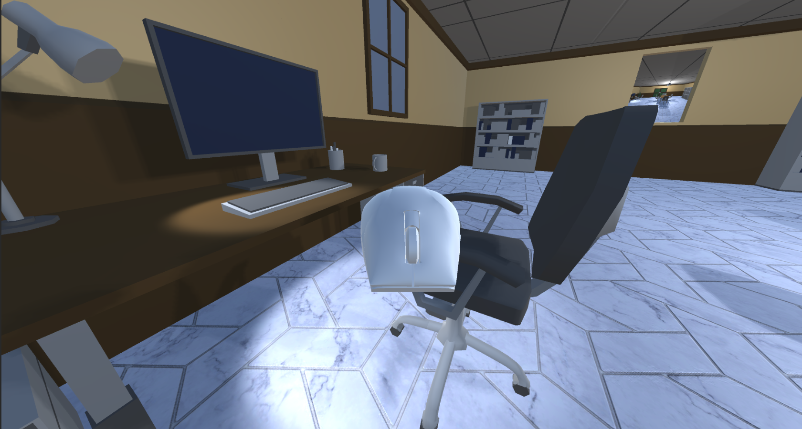
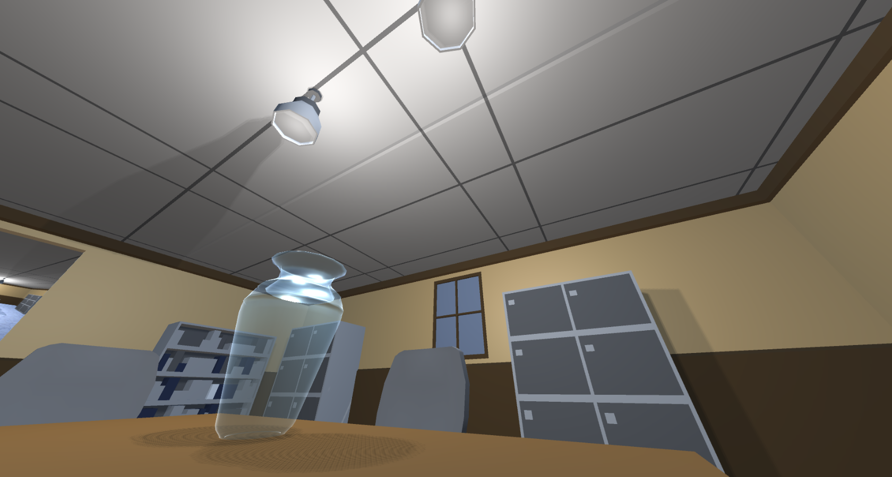
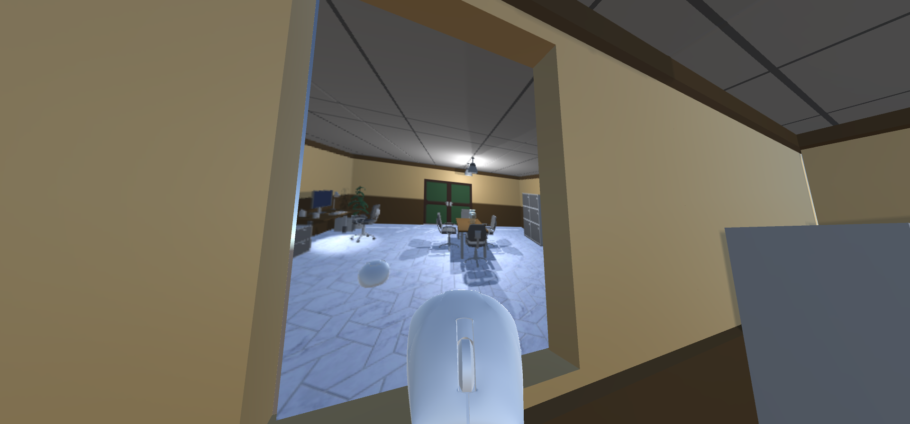
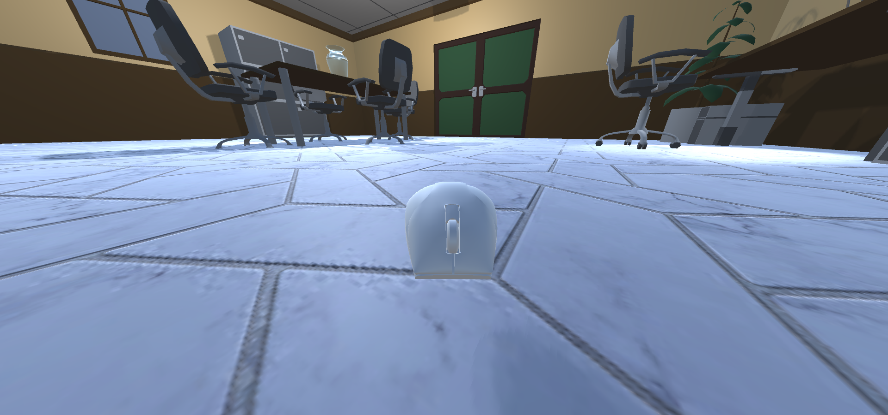

# Mouse Simulator

## Descrição

A ideia do projeto era ser um simulador de Rato (mouse), onde o mesmo poderia andar pelo cenário, que é um escritório.
Para interagir com o personagem do jogom, utiliza-se as teclas W, A, S, D ou as setas direcionais para a movimentação e o mouse para rotacionar o campo de visão. Também é utilizado o Scrool do Mouse para alterar a altura que o rato está, pois a ideia é que em futuras implementações, possua colisão e que a tecla de espaço seja utilizada para pular entre objetos.

Possui exemplos de transparência e espelho
Iluminação do tipo point light e spot light
Material com mapeamento de texturas do tipo normal map, height map e occlusion

## Print da tela

## Ambiente
Foi desenvolvido utilizando o Unity 2020.3.35
Snaps Prototype | Office
